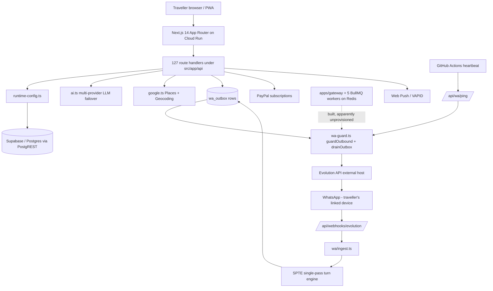
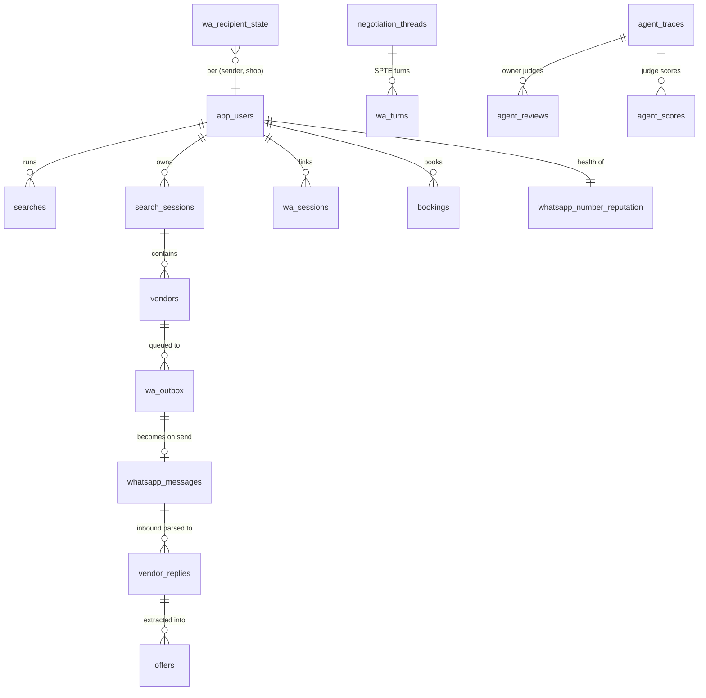

# WheelDeal - Deep Project & Application Audit

> **What this document is.** A reverse-engineered technical reference for the
> system **as built**, derived from the source rather than from the other
> documents in this repository. It exists so that a senior engineer, a new
> developer or an AI agent can understand and safely change WheelDeal without
> first reading 257 library modules.
>
> **Audit date:** 2026-08-10 · **Branch:** `claude/rental-agents-legal-setup-o7rgcv`
> · **Commit at audit:** `6689377`
>
> ---
>
> ### How to read the evidence tags
>
> | Tag | Meaning |
> |---|---|
> | **[FACT]** | Traced to a file the auditor opened. A path is cited. |
> | **[INFERRED]** | A strong architectural reading no single file states outright. The basis is given. |
> | **[VERIFY]** | Plausible, unconfirmed. Says what would settle it. |
> | **[UNKNOWN]** | Could not be established from the repository. |
>
> **An inference presented as a fact is this document's primary failure mode**,
> and this repository has paid for that pattern at least three times - see
> *Technical Debt → Comments that contradict the code*. Where a comment and the
> code disagree, this audit records both and says which one runs.
>
> ### Documents this audit deliberately does not trust
>
> - **`README.md` is materially stale [FACT].** It describes an
>   OpenStreetMap-based "demo mode" product with a five-agent ecosystem. It
>   predates WhatsApp integration, Evolution, SPTE, the graph engine, the outbox
>   state machine, the warm-up gate and the WABA lane. Anyone building a mental
>   model from it will build the wrong one.
> - `MASTER-PLAN.md` (4,500 lines) is a **plan**, not a description of what runs.
> - `ANTI-BAN.md` is **superseded** wherever it disagrees with `MASTER-PLAN.md`
>   Part 0.37, and describes at least one defence that is inert.
> - `V2-BLUEPRINT.md` is an architecture **proposal** plus its migration plan.
> - `GUIDE.md` is a deployment runbook; `PRODUCTION-READINESS.md` is a scale review.
>
> None of them describes the system as built. That gap is what this file fills.

---

# Executive Summary

**1. What is this application?**

WheelDeal is a mobile-first web app that finds and *negotiates* short-term
vehicle rentals (scooters, motorbikes, cars) near a traveller's accommodation.
The traveller describes what they want; the system discovers nearby rental shops
via Google Places, then autonomously conducts a **WhatsApp negotiation with each
shop, sent from the traveller's own WhatsApp number**, and surfaces the resulting
quotes ranked by price. [FACT: `src/app/page.tsx`, `src/lib/google.ts`,
`src/lib/wa/*`, `src/lib/spte/*`]

**2. What problem does it solve?**

In Southeast Asia, India and South America, rental shops have a WhatsApp number
and nothing else - no website, no booking form, no published price. Getting a
fair price means messaging a dozen shops individually and haggling in each
thread. WheelDeal does that concurrently and automatically. [INFERRED from the
product surface plus `MASTER-PLAN.md` Context §2; the constraint itself is an
owner assertion, not a repository fact.]

**3. How does it work, in one paragraph?**

A Next.js app on Cloud Run compiles the traveller's request into a structured
RFQ, ranks nearby shops, and writes one **outbox row per shop** to Supabase. A
guarded drain (`guardOutbound` → `drainOutbox`) releases those rows at a
human-like pace through **Evolution API**, an unofficial WhatsApp bridge running
the traveller's linked device session. Shop replies arrive on a webhook, are
de-duplicated and privacy-gated, and are handed to a **single-pass turn engine
(SPTE)** which composes the next negotiating message with an LLM under
deterministic guard rails. Extracted prices flow back to the UI. Almost all
system state - config, secrets, queues, telemetry - lives in 54 Supabase tables
accessed over PostgREST. [FACT: traced end to end; see *Critical Flows*.]

**4. Major architectural components**

Next.js 14 App Router (UI + 127 API routes) · Supabase/Postgres over PostgREST ·
Evolution API (external host, WhatsApp/Baileys) · a multi-provider LLM layer
with failover · an Express gateway and 5 BullMQ workers on Redis (**built and
apparently unprovisioned**) · PayPal subscriptions · Web Push.

**5. Most important dependencies**

Supabase (if it is down, essentially nothing works - it is the config store, the
queue and the database), Evolution API (all WhatsApp I/O), and at least one LLM
provider (degrades to deterministic heuristics rather than failing).

**6. Most important technical risks**

1. **Two runtimes, one of which may not exist.** A large amount of design exists
   because Cloud Run throttles CPU at response flush; a persistent worker tier
   was built to fix that and is recorded as unprovisioned.
2. **The product's core action carries irreducible account risk to its users** -
   unsolicited business messaging from a personal number over an unofficial
   client. The codebase is unusually honest about this; the risk is real.
3. **Fail-green reads.** The single most repeated defect class in this
   repository's history: a failed database read rendered as a healthy zero.
4. **Secrets are stored in the database** the application also uses for data.

**7. Most critical parts**

`src/lib/runtime-config.ts` (everything reads config through it),
`src/lib/wa/wa-guard.ts` (every outbound message passes through it),
`src/lib/wa/ingest.ts` (every inbound message), and `src/lib/session.ts` (the
entire authorization model).

---

# Product

## Purpose

Get a traveller the cheapest real, negotiated rental price near where they are
staying, without them having to message anyone.

## Core user journeys [FACT: `src/app/page.tsx`, `src/app/deals/page.tsx`, `src/app/profile/page.tsx`]

1. **Sign up → link WhatsApp.** Passwordless email or Google. Linking pairs the
   traveller's WhatsApp as a *linked device* via QR or pairing code, behind an
   explicit risk-acknowledgement consent.
2. **Build a request.** A step-by-step wizard (`RequestBuilder.tsx`) collects
   vehicle class, specs, extras and - in an always-visible panel above the
   wizard - the rental window.
3. **Search.** Places discovery returns nearby shops; the traveller selects
   which to contact.
4. **Mass Bargain.** One outbox row per selected shop; the dispatch pipeline
   paces them out.
5. **Watch.** A live status panel, a two-segment progress bar, per-shop stage
   badges, and a horizontal "quotes so far" rail.
6. **Close.** The traveller picks an offer; the thread continues from their own
   WhatsApp.
7. **Trips.** Past search sessions and bookings.

## What makes this not a CRUD app

The negotiation is autonomous and multi-turn; the outbound path is a paced,
leased, rate-governed queue with an anti-ban governor; the LLM output passes
through deterministic rails that can reject it; and there is a learning loop
that versions the agents' own behaviour spec behind a golden-replay gate.

---

# Architecture

## High-level



## The two runtimes - the single most important architectural fact

**[FACT]** The system spans two execution environments with opposite properties,
and most of the unusual machinery exists to bridge them.

| | Next.js on Cloud Run | Worker tier |
|---|---|---|
| Where | `Dockerfile`, `.github/workflows/deploy-gcp.yml` | `apps/gateway`, `services/workers`, `infra/gcp/` |
| Lifetime | One HTTP request | Persistent |
| CPU after response flush | **Throttled to ~0** | Unaffected |
| State | None | Redis + BullMQ |
| Status | Live | **Recorded as not provisioned** (task #127) |

Consequences visible throughout the code **[FACT]**:

- `finishBeforeResponse` exists because un-awaited work simply stops.
- Dispatch is driven by a **self-kicking HTTP tick chain**, not a timer, and
  every hop must resolve a *routable* origin - `req.url` on Cloud Run yields the
  bind address `0.0.0.0:8080`, which is why `src/lib/request-origin.ts` exists.
- Long work is **leased** in the database rather than held in memory.
- `recordUsage` in `src/lib/ai.ts` documents that an un-awaited insert was the
  reason the providers page read zero.

**[VERIFY]** Whether the worker tier runs in production cannot be determined
from the repository. `infra/gcp/README.md` describes it; `REDIS_URL` being unset
is what makes `hotStateClient()` return null. Checking the live GCP project
would settle it, and it changes the answer to "what drains the queue".

## Repository structure

```
/                       Next.js app + npm workspaces root
├── src/app/            App Router: pages + 127 API route handlers
├── src/lib/            257 modules - all business logic  ← the real system
├── src/components/     110 React components
├── supabase/schema.sql 54 tables, 1,532 lines, additive-only
├── apps/gateway/       Express gateway (1 file)
├── services/workers/   5 BullMQ workers + index
├── packages/           core, db, queues, redis, shared, testing
├── infra/{gcp,docker}/ Worker-tier infrastructure
├── .github/workflows/  deploy-gcp.yml, heartbeat.yml
└── scripts/            Operator scripts + the i18n catalogue generator
```

**Production-critical:** `src/lib/`, `src/app/api/`, `supabase/schema.sql`,
`Dockerfile`, `.github/workflows/`.
**Built but of uncertain live status:** `apps/`, `services/`, `packages/`, `infra/`.
**Not production:** `scripts/`, and `dump.rdb` - a local Redis dump sitting at
the root. It is **untracked and gitignored** (`.gitignore:36`), so it is a
working-copy artefact, not part of the repository.

## Where the business logic lives

**[FACT] There is no route → controller → service → repository layering.** Route
handlers are thin; **`src/lib/` is the service layer**, and `runtime-config.ts`
is the repository layer (thin typed wrappers over PostgREST). Several route
handlers do contain real logic - `src/app/api/outreach/mass/route.ts` is the
clearest example, and it is one of the more complex files in the system.

---

# Frontend

**Stack [FACT]:** Next.js 14 App Router, React 18, TypeScript, Tailwind
(`tailwind.config.ts` + a large hand-written `src/app/globals.css`), Leaflet +
react-leaflet for maps, `@tanstack/react-virtual` for list windowing. PWA via
`src/app/manifest.ts`.

**State management [FACT]:** No Redux/Zustand/React Query. Local `useState` plus
polling `useEffect`s. Cross-cutting state uses two patterns: React context
(`src/lib/i18n.tsx`) and a **module-level listener set** (`NavVeil.tsx`'s
`startNav`/`stopNav`). Client persistence is `localStorage` (`wd_theme`,
`wd_lang`, `wd_prefs`, `wd_currency`) plus search-session restore in
`src/lib/client/`.

**Key routes**

| Route | Purpose |
|---|---|
| `/` | The funnel: request builder → discovery → dispatch → offers → booking. The largest client file. |
| `/deals` | Past search sessions and bookings |
| `/profile` | Identity, currency, WhatsApp linking, alerts, preferences, legal |
| `/admin` | Owner/management workspace, ~12 lazily-mounted tabs |
| `/login`, `/welcome`, `/pricing`, `/terms`, `/privacy` | Auth and public surface |
| `/h/[token]` | WABA one-tap handoff redirect (inactive while the flag is off) |

**Notable components:** `VendorCard` · `VirtualVendorList` (window-scroll
virtualizer - deliberately *not* a scroll container, to preserve scroll
restoration and iOS momentum) · `QuotesRail` · `RequestBuilder` ·
`BatchProgressBar` · `WaConnect` · `Skeleton`/`LoadingDots`/`NavVeil` (+ the
shared `.aurora` glow) · `admin/BanRiskPanel`.

**Frontend → backend [FACT]:** plain `fetch` to same-origin `/api/*`, no client.
Auth is the `wd_session` cookie, sent automatically. Polling is the dominant
sync mechanism - `/api/activity`, `/api/replies`, `/api/wa/status` - and is
identified in `MASTER-PLAN.md` §5.6 as the scale bottleneck.

**i18n [FACT]:** English is the source. Every UI string is wrapped in `t()`, and
`scripts/gen-i18n-catalog.js` generates `src/lib/i18n-catalog.ts` from the
literals. `/api/translate` machine-translates missing strings, validates each
result (`i18n-validate.ts`) and caches per language. Owner corrections live in a
**separate** config row (`i18n-overrides.ts`) precisely so the translator's own
rewrite cannot destroy them.

---

# Backend

## API surface

127 route handlers **[FACT]**, grouped:

| Group | Examples | Gate |
|---|---|---|
| Core funnel | `profile`, `vendors`, `negotiate`, `safety` | session |
| Outreach | `outreach`, `outreach/mass` | session |
| WhatsApp control | `wa/status`, `wa/ping`, `wa/tick`, `wa/reply-tick`, `wa/health` | mixed |
| Webhooks | `webhooks/evolution`, `webhooks/whatsapp`, `webhooks/paypal` | signature / secret |
| Activity | `activity`, `replies`, `deals` | session |
| Billing | `billing/checkout`, `billing/confirm` | session + warm-up gate |
| Admin | `admin/*` (~40 routes) | `requireManagement` |
| Owner-only | `admin/ops/*` | `requireOwner` |

## The data access layer - `src/lib/runtime-config.ts`

**[FACT]** No ORM. Direct `fetch` to Supabase's PostgREST endpoint with the
service-role key. The exported helpers are the entire database API:

| Helper | Semantics | Use for |
|---|---|---|
| `sbSelect` | **Permissive** - returns `[]` on failure | Display data |
| `sbSelectStrict` | Returns `{rows}` or `{error:"missing"\|"unavailable"}` | **Safety gates** |
| `sbInsert`, `sbInsertReturning`, `sbUpdate`, `sbDelete`, `sbCount` | | |

**This distinction is load-bearing and is the source of a recurring defect
class.** `sbSelect` cannot distinguish "no rows" from "database unreachable". A
budget gate reading `sbSelect` treats an outage as *zero budget used* and opens
completely. `MASTER-PLAN.md` §9.10 records this being fixed for
`introductionsInWindow`; the same shape has been fixed on the Command Center,
the WhatsApp banner, `classifySafety`, and (at this commit) the Ops KPI page.

## Configuration and secrets - the same file

**[FACT]** Resolution order is **Supabase `app_config` override → `process.env`**,
cached ~30s per instance.

- Values written through the admin UI are **AES-256-GCM encrypted at rest**, with
  the key derived from `SESSION_SECRET`.
- Bootstrap secrets (Supabase URL/key, `SESSION_SECRET`) are env-only.
- The whole-table read filters `key=not.like.I18N_*` to keep large translation
  dictionaries out of every cold start. **`getConfigExact(name)` exists to read
  those rows by exact key** - and the code comment claimed that reader existed
  long before it did, which made the translation cache write-only.
- `src/lib/config.ts` holds the admin allowlist (`KEYS`). `setKey` refuses any
  name absent from it. Entries carry `secret?: boolean` (defaulting to *secret*),
  so settings like model ids display in full while credentials are masked.

## Authentication and authorization - `src/lib/session.ts`

**[FACT]**

- Cookie `wd_session` = base64 payload + **HMAC-SHA256** signature, verified with
  `timingSafeEqual`. It holds **only the email**.
- **The role is never in the cookie and never from client input.** `getSession()`
  re-derives it: `isOwner` from `OWNER_EMAIL`, `isAdmin` from the `ADMIN_EMAILS`
  allowlist. This is the correct design and is the system's single most important
  security property.
- Server-side expiry is enforced independently of the cookie's `maxAge`, because
  `maxAge` only instructs the browser.
- `requireManagement()` and `requireOwner()` are the two gates; every `admin/*`
  route calls one.

## Asynchronous execution

**[FACT]** Four mechanisms coexist:

1. **The self-kicking tick chain** - the live path. `/api/wa/tick` and
   `/api/wa/reply-tick` call themselves through `publicRequestOrigin()` for a
   bounded number of hops. Fragile by nature: it depends on the app being able
   to address itself.
2. **The external heartbeat** - `.github/workflows/heartbeat.yml` pings
   `/api/wa/ping`. This is what makes dispatch work with no user present.
3. **Database-scheduled work** - `wa_outbox.not_before` and `graph_wakeups` are
   *timestamps*, not timers, so a restart loses nothing.
4. **BullMQ workers** - `scheduler` (20s drain), `incoming`, `outbound`,
   `outreach`, `vision` (hard concurrency 2 for RAM). Built; live status unknown.

---

# Database

**Technology [FACT]:** Supabase Postgres, accessed **only** over PostgREST with
the service-role key. RLS is enabled on tables with **no policies** - the anon
key gets zero access by design (`supabase/schema.sql:312+`). Schema changes are
**additive-only** (`create table if not exists`, `add column if not exists`);
there is no migration tool and no down-migrations.

## Entity map



## The tables that matter most

| Table | Role | Why it is critical |
|---|---|---|
| `app_config` | **Config + encrypted secrets** | Everything reads through it |
| `wa_outbox` | Outbound state machine | The queue. Lease via `not_before` |
| `whatsapp_messages` | Wire log, both directions | Source of truth for what was sent |
| `wa_sessions` | Per-user Evolution link | Instance, status, proxy token |
| `whatsapp_number_reputation` | Per-user health scalars | Feeds the ban governor |
| `wa_recipient_state` | Per (sender, shop) intro/reply ledger | Tail-canonicalised. The metered quantity |
| `wa_send_claims` | Atomic gap claim | The only cross-instance send mutex |
| `wa_inbound_seen`, `wa_processed` | Idempotency | Webhooks are at-least-once |
| `search_sessions`, `vendors`, `offers` | Product data | |
| `agent_traces/scores/reviews`, `policy_versions`, `agent_golden_cases` | Learning loop + its gate | |
| `wa_risk_events`, `wa_risk_snapshots`, `wa_policy_versions` | Ban-risk observability | |
| `waba_leads/agencies/events/rollups` | Official-API lane | **Written only when `WABA_ENABLED` is on - currently off** |

**One structural invariant worth naming [FACT]:** the partial unique index
`wa_outbox_pending_auto_uidx` makes "one pending automatic row per (sender,
shop)" a *database* guarantee. Concurrent mass-bargain runs are serialised by
Postgres, not by application logic. Do not drop it.

---

# Integrations

| Service | Purpose | Implementation | Auth | If unavailable |
|---|---|---|---|---|
| **Supabase** | Database, config, secrets, queue | `src/lib/runtime-config.ts` | Service-role key (env) | **Near-total outage.** Permissive reads degrade to empty; strict reads fail closed |
| **Evolution API** | WhatsApp send/receive via the traveller's linked device (Baileys) | `src/lib/evolution.ts` (~2k lines) | API key per host | All messaging stops; app reports degraded state |
| **LLM providers** ×9 | Negotiation, profiling, translation, vision | `src/lib/ai.ts` | Bearer tokens | Automatic failover, then deterministic heuristics. **Degrades, never fails** |
| **Google Places / Geocoding** | Shop discovery | `src/lib/google.ts` | API key | Falls back to a demo shop list |
| **PayPal Subscriptions** | Paid plans | `src/lib/paypal.ts`, `webhooks/paypal` | Client id/secret | No new subscriptions |
| **Web Push / VAPID** | Reply alerts | `src/lib/push/*` | VAPID pair (auto-provisioned) | No notifications |
| **Email** (Resend / Brevo / Gmail SMTP) | Verification, notices | `src/lib/email.ts` | Per-provider | Ladder of fallbacks |
| **Google AdSense** | Free-tier revenue | `src/components/AdBanner.tsx` | Client + slot id | Renders a labelled placeholder |
| **WhatsApp Cloud API (WABA)** | Official lane, Part 12 | `src/lib/waba/*` | Provider key | **Inactive** - `WABA_ENABLED` defaults off |

**Retry and rate-limit behaviour [FACT]:** `evolution.ts` implements host
failover and a breaker; `ai.ts` fails over provider-by-provider under a total
time budget; the outbox re-parks rows with reasons rather than dropping them.
`checkRateLimit` in `evolution.ts` is a second limiter beneath the guard, and
`MASTER-PLAN.md` §7.5/§9.1 records that the two have historically disagreed.

---

# AI / Agents

## Models and provider selection [FACT: `src/lib/ai.ts`]

Nine OpenAI-compatible-or-Gemini providers: Groq, Gemini, OpenRouter, Cerebras,
Mistral, Hugging Face, DeepSeek, Together, SambaNova. `AI_PROVIDER` names a
preferred one; the rest form the failover order. Each provider has a default
model and an optional `fallbackModel` retried on 400/404. Eleven
`<PROVIDER>_MODEL` / `*_VISION_MODEL` overrides are readable at runtime and
settable from the admin vault. With no key configured, `chat()` returns null and
callers use deterministic heuristics.

**Telemetry:** `ai_usage` records provider, tokens, failed, **and (at this
commit) the model actually sent and the trimmed provider error**.

## Agent architecture

**[FACT] There are two negotiation engines and they are not equals.**

- **SPTE** (`src/lib/spte/*`) - the primary. One inbound message → one
  "single-pass turn": load a session blackboard, build context, call the model
  once, run the output through rails, emit at most one outbound message.
- **The graph engine** (`src/lib/graph/*`) - a director/node/edge state machine
  with judges and strategic waits, gated by `GRAPH_ENGINE`. Retained as a
  fallback and for the learning loop's traces.

**[FACT] The LLM does not have the last word.** Composed text passes through
deterministic rails before it can be sent:

- numeric **provenance** - a price the model did not derive from the thread is
  rejected (`src/lib/integrity/*`, `checkOutboundNumbers`)
- **commitment** rails - the agent may not promise on the traveller's behalf
  (`spte/rails.ts`)
- **duration/window** rails - the rental window is immutable
- **safety screening** and **persona/humanisation** (`wa-guard.ts`)
- a **uniqueness gate** so two shops never receive identical text

This is the most important thing to understand about the AI here: **it drafts;
the rails decide.**

## Prompts

System prompts are constructed in `src/lib/agents.ts`, `src/lib/copy/promptCompiler.ts`
and `src/lib/spte/*`. The cold opener is **compiled deterministically**, not
generated - `compileOpener` assembles it from pools with region-aware register
(Thai/Filipino politeness particles), and the rental dates are interpolated
rather than described.

## Learning loop [FACT: `src/lib/ops/*`, `src/lib/policy.ts`]

Owner ratings, branch verdicts and corrections compile into
`app_config.ops_learning` (director priors, exemplars, judge calibration; kill
switch `OPS_LEARNING`). Thresholds live in a clamped `policy_overlay`. **Every
behaviour change is a `policy_versions` row gated by a deterministic golden
replay suite** (`agent_golden_cases` + `replayConversation` in
`src/lib/simulate.ts`), with one-click rollback. Never bypass `saveVersionedSpec`.

---

# Critical Flows

### Flow 1 - Cold outreach (the product's core action)

1. Traveller selects shops and taps Mass Bargain → `POST /api/outreach/mass`.
2. Route resolves plan capacity, ranks shops (`openNow` primary), and computes a
   **wave schedule** (`wa/waves.ts`) when the flag is on.
3. For each shop: claim a slot, compile the opener, write a **`wa_outbox` row**
   with `not_before` and wave metadata. The partial unique index prevents
   duplicates.
4. The route kicks the dispatcher via a **routable** origin (`request-origin.ts`).
5. `drainOutbox` selects rows with `not_before <= now`, **claims each with a
   lease** (`claimOutboxRow` PATCHes `not_before` forward), and passes it to
   `guardOutbound`.
6. `guardOutbound` applies: kill switch, cancellation, session liveness, sender
   wake window, recipient business hours, per-recipient gap claim, the two-meter
   unanswered budget, plan capacity, stealth/risk. It either **sends or re-parks
   with a reason** - it does not silently drop.
7. Send goes to Evolution. **A 2xx is not success** - a delivery receipt is
   required (task #138) before the row clears.
8. `whatsapp_messages` records the wire text; the UI reflects the new rung.

**Failure modes:** a lost lease re-arms (the winner pushed `not_before`
forward, so the loser sees a future row); a rate-limit refusal re-parks by the
limiter's own wait rather than as a host fault; a transient database failure
parks minute-scale, and the guard computes the **lane** so a composed reply is
never parked as long as a cold intro.

### Flow 2 - Inbound reply → negotiation turn

1. Evolution POSTs `/api/webhooks/evolution`.
2. The route derives a **routable** origin and calls `processEvolutionWebhook`
   (`src/lib/wa/ingest.ts`).
3. Idempotency: `wa_inbound_seen` / `wa_processed`. Webhooks are at-least-once.
4. **Privacy gate** - the receiving user is resolved from the instance, and an
   inbound from a number this user never wrote to is rejected (tasks #67, #85).
   The WABA lane needed a *narrow, pre-authorised* exception rather than a
   loosening (`waba/expectation.ts`).
5. `MESSAGES_UPDATE` events are classified: delivery, read, or **`status:"ERROR"`
   on a `fromMe` key = a restriction signal.
6. A genuine reply becomes an SPTE turn → rails → a new outbox row.
7. `reply-tick` is kicked so the reply lane drains promptly.

### Flow 3 - Config / secret read

`getConfig(name)` → 30s cache → `loadOverrides()` reads `app_config`
(`key=not.like.I18N_*`) → decrypt AES-256-GCM → fall back to `process.env`.
`getConfigExact` bypasses the filter for one key. `getConfigStrict`
distinguishes unset from unreadable for safety gates.

### Flow 4 - Auth

Login → email code or Google → `setSessionCookie(email)` writes
`base64(payload).hmac`. Every request: `getSession()` verifies the HMAC,
enforces server-side expiry, then **re-derives** the role from `ADMIN_EMAILS` /
`OWNER_EMAIL`.

### Flow 5 - Scheduled drain

`heartbeat.yml` → `/api/wa/ping` → drain outbox + `graph_wakeups` → self-kick
chain continues. **This is what makes the product work with nobody watching**,
and it is external to the app.

### Flow 6 - Subscription

`UpgradeSheet` → warm-up gate check → `/api/billing/checkout` (**server-side**
gate; a client-only gate is not a gate) → PayPal button → `webhooks/paypal`
confirms → plan written.

### Flow 7 - Translation

`t()` misses → batched `POST /api/translate` → owner overrides applied and
excluded from the model request → chunked LLM call with a per-string brief →
**per-element validation** → re-read-and-merge before writing the cache (a
last-write-wins bug fixed by shrinking the window to one round trip).

---

# Security

**Strong [FACT]**

- Role never trusted from the client; derived server-side every request.
- HMAC verified with `timingSafeEqual`.
- Secrets encrypted at rest in `app_config` (AES-256-GCM).
- RLS on with no policies - the anon key has zero access.
- The admin vault never returns raw secrets except through an explicit
  owner-only reveal; `mask()`/`displayValue()` govern what the browser sees.
- `setKey` refuses names outside an allowlist.
- Webhook secret paths/tokens for inbound endpoints.
- Consent is an append-only, version-stamped ledger; the `wa_link` consent write
  is **blocking** - no QR is issued if it cannot be recorded.

**Risks**

| Sev | Finding | Evidence |
|---|---|---|
| **High** | **The service-role key reaches every route.** There is no per-user database boundary; authorization is entirely application-level. A single missing `requireManagement()` is a full data exposure. | `runtime-config.ts` uses the service-role key for all access |
| **High** | **Secrets share a database with application data.** Encryption is derived from `SESSION_SECRET`; if that leaks, the vault decrypts. | `runtime-config.ts` encryption |
| ~~Medium~~ **None** | **`dump.rdb` at the repository root is NOT in version control.** It is present on disk but untracked and already covered by `.gitignore:36`. An earlier draft of this audit listed it as a committed secret-exposure risk; that was an inference from `ls` output, and `git ls-files` disproves it. Recorded here rather than deleted, because it is the exact failure mode this document warns about. **This audit did not open the file.** | `git ls-files dump.rdb` → empty; `.gitignore:36` |
| **Medium** | Rate limiting is per-user and application-level; no edge/WAF layer is configured in-repo. | no such config found |
| **Medium** | Some webhook endpoints rely on a secret path/shared header rather than a signature, where the provider does not sign. | `MASTER-PLAN.md` §12.6 item 8 records this as a known provider gap |
| **Low** | No CSRF tokens. The session cookie is `httpOnly`, `secure` in production, and **`sameSite: "lax"`** [FACT: `src/lib/session.ts:100-104`], and the API is same-origin - so a cross-site POST cannot carry the cookie. Adequate for the current surface; revisit if any state-changing endpoint ever becomes cross-origin. |

**No hardcoded credentials were found in source.** `.env*` is gitignored;
`.env.example` holds placeholders.

---

# Configuration

**Bootstrap (env-only, required):** `SUPABASE_URL`, `SUPABASE_SERVICE_ROLE_KEY`,
`NEXT_PUBLIC_SUPABASE_ANON_KEY`, `SESSION_SECRET`, `ADMIN_EMAILS`, `APP_DOMAIN`.

**Runtime (admin-settable, optional):** LLM tokens and the eleven model
overrides · `EVOLUTION_*` (hosts, key, proxy template/country) · `WHATSAPP_*`
(Cloud API) · `GOOGLE_MAPS_API_KEY` · email provider keys · `PAYPAL_*` ·
`ADSENSE_*` · `WABA_*` (all inert while `WABA_ENABLED` is off).

**Owner switches [FACT: `CLAUDE.md` + `src/lib/config.ts`]:** `TEST_MODE`,
`SCALE_MODE`, `HUMAN_TAKEOVER`, `GRAPH_ENGINE`, `OPS_LEARNING`, `KILL_SWITCH`,
plus the warm-up thresholds and the cohort primitive (`WA_COHORT`,
`WA_COHORT_PCT`).

**`APP_DOMAIN` is unusually load-bearing:** it drives SEO metadata, the geocoder
identity, push sender identity, self-kick origin resolution **and** the approved
WABA button base URL - so changing it invalidates approved message templates.

---

# Deployment

**[FACT]** `Dockerfile` builds a multi-stage Next.js **standalone** image on
`node:20-slim`, pulled from `mirror.gcr.io` (Docker Hub rate-limits shared CI
egress IPs). Listens on 8080, runs non-root. Every workspace manifest must be
copied before `npm ci` or the lockfile check fails.

`.github/workflows/deploy-gcp.yml` gates on **typecheck (root) → typecheck
(services) → typecheck (tests) → vitest → build**, then authenticates to GCP,
ensures the Artifact Registry repo, builds and deploys to Cloud Run.

`.github/workflows/heartbeat.yml` provides the external tick.

`render.yaml` is present and describes an Evolution host; `CLAUDE.md` states
deployment is **GCP-only**. **[VERIFY]** whether Render still hosts Evolution in
production - the two artefacts disagree and only the live environment settles it.

**[UNKNOWN]** The live GCP topology: whether the GCE worker VM, Redis and the
gateway are provisioned; the actual Evolution host(s); DNS/SSL. Task #127 is
recorded as pending.

---

# Error Handling & Reliability

**Patterns that recur, and are deliberate [FACT]**

1. **Fail-closed for safety, fail-open for display.** `sbSelectStrict` where a
   wrong answer would send a message; `sbSelect` where a wrong answer is a blank
   panel.
2. **Fail-dark for owner surfaces.** `src/lib/wa/risk-verdict.ts` defines
   `TileState = ok|warn|critical|dark|empty` with severity `empty < ok < warn <
   dark < critical`, and rules E1-E9. **An unreadable metric renders as a dash,
   never a zero.**
3. **Park with a reason, never drop.** Every outbox hold records why.
4. **Degrade, do not fail.** Every integration has a no-key path.
5. **Idempotency at every inbound boundary.**

**The recurring defect class, named explicitly:** *a failed read rendered as a
healthy zero.* Documented instances - the Command Center's nine
`.catch(() => [])`; a banner reading "Messaging: All good" over a dead webhook;
`classifySafety` answering from positive evidence only; and the Ops KPI page
(fixed at this commit). **When reviewing any new dashboard or gate in this
codebase, check this first.**

---

# Performance & Scalability

**No benchmark data was found in the repository.** The figures below are
architectural readings, not measurements.

**Known bottlenecks [FACT, from `MASTER-PLAN.md` §5.6 with the code confirmed]**

1. **Polling.** Three independent pollers, ~24 requests/min/user;
   `/api/activity` costs roughly 21 PostgREST round trips per tick **and
   performs two awaited 8-second WhatsApp drains before it reads anything**. A
   read endpoint that dispatches messages is the central scale problem.
2. **Session residency, not throughput.** Peak volume per user is trivial; the
   constraint is N always-on Baileys sockets on one Evolution host.
3. **`/api/activity`'s drain was not scoped to the polling user** - at scale every
   poller contends for every sender's queue.
4. **Unbounded JSON aggregation in memory** in some admin analytics routes -
   capped selects, JS-side aggregation.

**What is already right:** list virtualization; the 30s config cache; lazily
mounted admin tabs; hourly rollups instead of live fan-out for risk metrics; a
single query for per-provider last failures.

**Scaling strategy the repository points to:** move drains off read endpoints
onto the worker tier, add a change-detection cursor to `/api/activity`, and
provision the persistent tier so sockets and queues stop living in request
scope.

---

# Testing

**[FACT]** 247 test files, **3,706 tests**, Vitest. Plus an e2e harness
(`packages/testing/e2e.test.ts`, 6 tests) that requires `TEST_REDIS_URL` and
**silently skips when Redis is absent** - it passed against a local Redis during
this audit.

**Character of the suite:** overwhelmingly **pure-function and source-pin**
tests. Many assert that a specific defect cannot return by matching the source
(e.g. "no route builds a self-directed URL from `req.url`"). Very little
component rendering; no browser-level e2e in the repo.

**Strengths:** every safety invariant this project has learned the hard way is
pinned. Comments explain *which incident* each test descends from.

**Weaknesses / untested areas [INFERRED from the file list]:**

- Almost no React rendering tests - `AuthMethodList.test.tsx` is the exception.
- No integration test that exercises a route handler against a real database.
- Source-pin tests are brittle by construction: they can fail on a refactor that
  changes nothing behavioural, and they can *pass* while behaviour drifts, if
  the pinned string survives. Two instances of exactly that were corrected
  during this audit's own work.
- The e2e harness skipping silently means CI may report green having run nothing.

---

# Observability

**Present [FACT]:** `agent_events` and `agent_traces` (structured, queryable) ·
`ai_usage` · `wa_risk_events` (22 kinds, two axes) + hourly `wa_risk_snapshots`
· `/api/wa/health` and `/api/admin/heartbeat-test` · the WA Doctor
(`/api/admin/wa-doctor`) · the Command Center · the Ban Risk panel ·
`src/lib/ops/vitals.ts` (`pulse()` distinguishes **"never"** from **"stale"** -
different failures, different fixes).

**Absent [FACT: no such dependency or config found]:** no Sentry or error
tracker, no metrics backend, no distributed tracing, no alerting beyond in-app
owner alerts and push. `pino` is a dependency but structured logs have no sink.

**How an engineer debugs production today [INFERRED]:** open Admin → Command
Center for alerts, → risk for the ban axes, → the WA Doctor for one user's
pipeline, then query Supabase directly. `trace_id` is stamped through the
WhatsApp path, so a single message can be followed across tables.

---

# Code Quality

**Strengths**

- **The comments are the best asset in this repository.** They routinely record
  *why* a line exists and *which incident* produced it. This is rare and it is
  what makes the system tractable.
- Genuinely good abstractions: the `sbSelect`/`sbSelectStrict` split; the
  fail-dark `TileState` contract; the outbox state machine; versioned specs with
  a replay gate; phone-tail canonicalisation in one place.
- Pure logic separated from rendering (`progress.ts` + `BatchProgressBar`,
  `quotes-rail.ts` + `QuotesRail`).
- Consistent no-key degradation.

**Weaknesses**

| Issue | Location | Why it matters | Severity |
|---|---|---|---|
| **Very large files** | `src/app/page.tsx`, `src/app/admin/page.tsx`, `src/lib/evolution.ts`, `src/lib/wa/wa-guard.ts` (each ~2-4k lines) | Hard to review; merge-conflict prone; the funnel page holds most client state | High |
| **Logic in route handlers** | `api/outreach/mass/route.ts` | The most consequential business logic is not in `lib/`, so it is not unit-testable in isolation | Medium |
| **Two negotiation engines** | `spte/` and `graph/` | Doubles the surface for any change to negotiation behaviour | Medium |
| **Source-pin test brittleness** | throughout `src/lib/*.test.ts` | Refactors break tests that assert nothing behavioural | Medium |
| **`any` in admin client state** | `admin/page.tsx:399` | The admin page loses type safety exactly where the data shapes are most volatile | Low |

## Technical debt - specific items

1. **`README.md` describes a product that no longer exists.** *Impact:* every new
   reader starts wrong. *Fix:* rewrite from this document. **Low complexity.**
2. **Comments that contradict the code** - the repository's most dangerous debt,
   because the comments are otherwise trustworthy:
   - `ANTI-BAN.md` describes `CONNECT_FINGERPRINT` as a shipped defence;
     Evolution's `InstanceDto` has no such field and discards it.
   - `evolution.ts:180-184` claims any host can resume a session; only the
     `creds` blob is shared, not the Signal keys.
   - `wa-guard.ts:1528` cites "research" for a 0.6 delivery threshold that
     traces to an unsourced README default.
   *Fix:* correct or delete each. **Low complexity, high value.**
3. **Read endpoints perform writes and dispatch.** `/api/activity` drains the
   WhatsApp queue. **Medium-High complexity**, large scale payoff.
4. **The worker tier is built and (apparently) unused.** Either provision it or
   mark it dormant in the docs; a large unprovisioned subsystem misleads readers
   about what runs. **Medium.**
5. **Two rate limiters.** `checkRateLimit` (15/hr) sits beneath the plan
   capacity model (up to 40/window); history records them disagreeing. **Medium.**

---

# Critical System Invariants

**Do not break these. Each is load-bearing and most were learned from an
incident.**

1. **The session role is derived server-side, never read from the client.**
   (`session.ts`)
2. **Safety gates use `sbSelectStrict`.** An unreadable budget must deny, not
   permit. (`runtime-config.ts`, `wa-guard.ts`)
3. **An unreadable metric renders dark, never zero.** (`risk-verdict.ts`)
4. **Self-directed URLs come from `publicRequestOrigin()`, never `req.url`.**
   On Cloud Run `req.url` yields `0.0.0.0:8080` and the dispatcher dies silently.
5. **Every outbox row is claimed with a lease before work starts**, and a row
   that cannot be finished is not started.
6. **A 2xx from Evolution is not a delivered message.** A receipt is required.
7. **One pending automatic outbox row per (sender, shop)** - enforced by
   `wa_outbox_pending_auto_uidx`. Do not drop the index.
8. **Phone identity is canonicalised on the national tail at every boundary.**
   Splitting rows across spellings breaks the reply ledger.
9. **Inbound from an unknown number is rejected.** Widen only with a narrow,
   pre-authorised expectation - never by loosening the gate.
10. **The LLM drafts; the rails decide.** Numeric provenance, commitment and
    window rails may reject model output.
11. **Behaviour-spec changes go through `saveVersionedSpec` and the golden replay
    gate.** Never write the graph spec or overlay directly.
12. **Schema changes are additive.** `if not exists` throughout.
13. **`WABA_ENABLED` off means nothing changes** - no new table read, no new
    request. Pinned by test.
14. **Never claim safety the code does not deliver.** Eight false safety strings
    were deleted for this reason; the lint test enforcing risk vocabulary
    placement is the mechanical form of it.
15. **Secrets never reach the browser** except through the owner-only reveal;
    `secret` defaults to true for new vault keys.

---

# Unknowns & Gaps

| # | Unknown | Why | What would settle it |
|---|---|---|---|
| 1 | **Is the worker tier provisioned?** | Infrastructure is not in this repo | The live GCP project; whether `REDIS_URL` is set |
| 2 | **Where does Evolution actually run?** | `render.yaml` and `CLAUDE.md` disagree | The live deployment |
| 3 | **Real traffic, cost and reply rate `q`** | No telemetry export in-repo | Production Supabase. `q` is unmeasured and several SLA claims rest on it |
| 4 | **Whether WABA credentials exist** | Flag defaults off; no credentials here | Owner |
| 5 | **Contents of `dump.rdb`** | Not opened. Untracked and gitignored, so it is a local artefact rather than a repository risk | An operator, offline |
| 6 | **Live Supabase RLS state** | Only the checked-in schema was read; production may differ | The Supabase dashboard |
| 7 | **Whether the pinned Evolution/Baileys version matches production** | Version claims come from planning docs, not from a lockfile in this repo | The Evolution host |
| 8 | **Actual test coverage %** | No coverage config or report found | Add `vitest --coverage` |
| 9 | **`sameSite` value on the session cookie** | Not verified line-by-line during this pass | `src/lib/session.ts:100` |

---

# Recommendations

### P0 - Critical

**P0.1 Correct the three comments that contradict the code.**
*Evidence:* `ANTI-BAN.md` on `CONNECT_FINGERPRINT`; `evolution.ts:180-184` on
failover; `wa-guard.ts:1528` on the 0.6 threshold. *Impact:* in a codebase whose
comments are otherwise reliable, a lying comment is worse than none - it will be
"restored" by someone believing they are preserving intent. *Complexity: Low.*

### P1 - High

**P1.1 Take the WhatsApp drains out of the read endpoints.**
*Evidence:* `/api/activity` and `/api/replies` await 8-second drains before
reading. *Impact:* the dominant scale bottleneck, and it makes a read endpoint
capable of sending messages. *Fix:* move to the scheduler/worker tier.
*Complexity: Medium.*

**P1.2 Decide the worker tier's fate and write it down.**
*Evidence:* `apps/`, `services/`, `packages/`, `infra/` are built; task #127 is
pending. *Impact:* a large subsystem of ambiguous status misleads every reader
about what actually runs. *Complexity: Medium (provision) or Low (document).*

**P1.3 Rewrite `README.md` from this audit.**
*Evidence:* it describes a pre-WhatsApp demo product. *Complexity: Low.*

**P1.4 Make the e2e harness fail loudly when Redis is absent.**
*Evidence:* it skips silently; CI can report green having run nothing.
*Fix:* fail the run unless an explicit `E2E_SKIP=1` is set. *Complexity: Low.*

### P2 - Medium

**P2.1 Extract `api/outreach/mass/route.ts`'s logic into `src/lib/`.**
The most consequential business logic in the system is currently untestable in
isolation. *Complexity: Medium.*

**P2.2 Split `src/app/page.tsx` and `src/app/admin/page.tsx`.**
Both are multi-thousand-line client components holding most of their surface's
state. *Complexity: Medium-High. Do it incrementally, behind the existing
render-isolation boundary.*

**P2.3 Add a change-detection cursor to `/api/activity`.**
Answer with one or two indexed `max()`/`count()` queries and short-circuit when
nothing moved. *Complexity: Medium.*

**P2.4 Add an error sink.** `pino` is already a dependency with nowhere to write.
*Complexity: Low.*

**P2.5 Reconcile the two rate limiters.** One owner of velocity; make the other
strictly non-binding or delete it. *Complexity: Medium.*

### P3 - Low

**P3.1** Type the admin page's `aiProviders` state instead of `any[]`.
**P3.2** Add `vitest --coverage` so untested areas are visible rather than inferred.
**P3.3** Prune superseded planning docs, or add a header to each stating what
supersedes it.

---

# Final Architecture Summary

WheelDeal is a **serverless Next.js application wrapped around a durable,
database-backed message queue** whose consumer is an external WhatsApp bridge.
Almost every unusual design decision follows from one constraint: **Cloud Run
stops executing your code when the response flushes**, so anything that must
outlive a request is a timestamped row, a lease, an idempotency key, or an
external heartbeat.

Layered on top is a negotiation system in which an LLM drafts and deterministic
rails decide, and around that a governor whose job is to keep the traveller's
personal WhatsApp account alive while it does something that account was never
meant to do.

The codebase's defining characteristic is **institutional memory encoded in
comments and tests**. Its recurring failure mode - which the team has now
diagnosed and fixed at least five times - is **a failed read rendered as a
healthy zero**. Anyone extending this system should learn that pattern first;
it is the difference between a change that is safe here and one that is not.

---

*Produced by static analysis of the repository at commit `6689377`. No runtime,
production database or live deployment was accessed. Every claim tagged
**[UNKNOWN]** or **[VERIFY]** requires access this audit did not have.*
